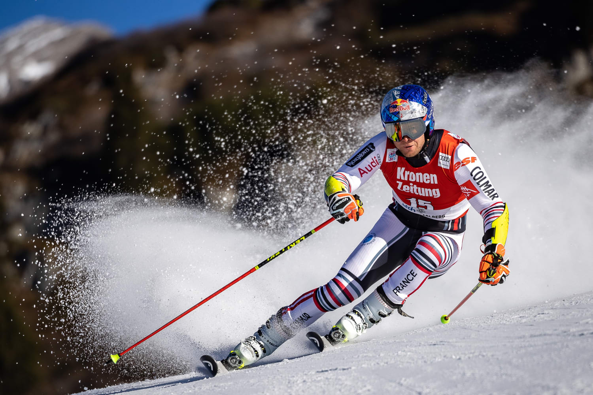

```{r setup, echo=FALSE, results='hide', message=FALSE, warning=FALSE}
knitr::opts_chunk$set(echo=FALSE, message=FALSE, warning=FALSE)

# Uvoz vseh potrebnih knjižnic
source("lib/libraries.r", encoding="UTF-8")
```


## Izbira teme

```{r, echo=FALSE, out.width="60%", out.height= "60%", fig.cap="Zmagovalec skupnega seštevka 2020/21 Alexis Pinturault", fig.align='center'}

```

V zadnjih letih je v alpskem smučanju veliko govora o izbiri opreme in nastavitev, zato sem se odločila analizirati, katere smuči so najboljše. Pri tem sem upoštevala naslednje parametre:

* snežna podlaga
* disciplina
* temperatura

Pri tem sem gledala uvrstitve na stopničke, zmage in skupno število točk v posamezni disciplini, ki so jih dosegli smučarji z določenim proizvajalcem smuči v sezoni 2020/21.
Analizirala sem tudi rezultate tekem v tej isti sezoni, poleg tega pa sem med seboj po uspešnosti primerjala tudi države -- bolj podrobno za sezono 2020/21, za leta 1967 -- 2021 pa glede na zmago v skupnem seštevku svetovnega pokala (tako za moške kot za ženske).

## Obdelava, uvoz in čiščenje podatkov

```{r uvoz}
source("uvoz/uvoz.r", encoding="UTF-8")
```

Podatki o rezultatih in vremenu so bili prvotno v 38-ih ločenih `pdf` datotekh (ena
datoteka je vsebovala rezultate, vreme in še nekaj drugih podatkov, ki pa jih nisem
potebovala). Vse te datoteke sem pridobila iz [podatkovne baze FIS-a](https://www.fis-ski.com/DB/alpine-skiing/calendar-results.html?eventselection=results&place=&sectorcode=AL&seasoncode=2021&categorycode=WC&disciplinecode=&gendercode=M&racedate=&racecodex=&nationcode=&seasonmonth=X-2021&saveselection=-1&seasonselection=).
Te datoteke sem s posebnim programom pretvorila v obliko `csv`, nato pa sem jih uvozila v R. Posebaj sem uvozila vreme in posebaj rezultate.
Tako za vreme kot za rezultate sem napisala funkcije, ki so se sprehodile čez vse `csv` datoteke in jih pretvorile v tabele. Pri tem sem morala paziti, kdaj se vsaka datoteka začne brati -- tu sem si pomagala z regularnimi izrazi, ki sem jih vključila v funkcije.Tako sem pridobila `seznam_vremena1` in `seznam_vremena2`, kjer prvi predstavlja seznam (surovih) tabel za hitre discipline, drugi pa za tehnične. Seznama sta ločena, saj imajo tabele različno število stolpcev in vrstic zaradi različnega števila voženj na posamezni tekmi.
V vsaki posamezni tabeli za vreme so bili podatki o nebu, snegu in temperaturi.
Temperaturi sta bili dve -- ena na startu in ena na cilju. Pri tehničnih disciplinah so bili vsi ti podatki dvojni, saj sta tam dve vožnji.
Za vsako tekmo sem izluščila en podatek o nebu, enega o snegu in enega o temperaturi (dobljeno s povprečjem). Nato sem podatke o vremenu iz seznama tabel z indeksiranjem določila za vsako tekmo posebaj.

Rezultate sem uvažala na podoben način. Torej: napisala sem funkcije za uvoz, se sprehodila čez podatke in jih shranila v seznam tabel. Nato sem tabele dobila iz seznama z indeksiranjem, dodala vreme in ime prizorišča. To sem storila za vsako disciplino posebaj, saj so bile tabele med seboj različne.
Tako sem dobila tabele `slalom`, `veleslalom`, `superG` in `smuk`. Te sem preuredila tako, da so bili podatki pravih tipov, in potem sem prvi dve omenjeni tabeli združila v tabelo `tehnicne`, drugi dve pa v tabelo `hitre`. Ti dve tabeli sem nato preoblikovala tako, da se ju je dalo združiti v končno tabelo, ki sem ji dodala še vektor `tocke_30` s točkami, ki jih dobijo tekmovalci na prvih 30-ih mestih.
Končna tabela `REZULTATI.VREME` vsebuje stolpce:

* `Rank` -- uvrstitev tekmovalca na tekmi
* `Name` -- ime tekmovalca
* `YB` -- leto rojstva
* `NSA` -- država (National Ski Association)
* `Ski` -- smuči
* `venue` -- prizorišče tekme
* `Disciplina` -- disciplina
* `temperatura` -- povprečna temperatura zraka
* `vreme` -- vreme na tekmi
* `sneg` --  snežna podlaga
* `tocke_30` -- točke, dosežene na tekmi, ki se štejejo v skupni seštevek svetovnega pokala

To tabelo sem potem tekom projekta večkrat preoblikovala, da mi je pokazala podatke, ki sem jih v danem trenutku potrebovala.

Za konec sem uvozila še tabelo iz `html` oblike, ki sem jo pridobila iz spletne strani [AlpineSkiDataBase](https://ski-db.com/db/stats/overall_m_gc.php).
Na strani je bilo več tabel, izbrala pa sem tisti dve, ki vsebujeta podatke o dobitnikih velikih kristalnih globusov v preteklih sezonah (ena za moške in ena za ženske). Tu sem morala preurediti letnice in pa odstraniti nekaj nepotrebnih stolpcev. Končni tabeli `zmagovalci` in `zmagovalke` vsebujeta podatke o zmagovalcih preteklih sezon (po državah) in sem ju uporabila za upodobitev na zemljevidu.

## Analiza in vizualizacija podatkov

```{r vizualizacija, results='hide'}
source("vizualizacija/vizualizacija.r", encoding="UTF-8")
```

### Analiza sezone 2020/21

```{r, fig.align='center'}
print(graf1)
```

Na prvem grafu lahko opazujemo, v katerih disciplinah se najbolje odzivajo posamezne smuči. Največ točk so dosegle smuči Atomic, Head in Rossignol.
Opazimo pa lahko, da so smuči **Atomic** najbolj uravnotežene, torej jih izbirajo vsestranski tekmovalci, ki tekmujejo v vseh disciplinah; medtem ko so **Rossignol** izrazito tehnične smuči, **Head** pa bolj namenjene hitrim disciplinam.
To kaže na večjo kakovost smuči Atomic in Head, saj smučarji v hitrih disciplinah isti nabor smuči uporabljajo več let, v tehničnih disciplinah pa jih menjajo vsako sezono.

Sledijo smuči proizvajalcev Fischer in Salomon, preostale smuči pa dosegajo slabše
rezultate. Izjema je Stoeckli, ki dosega vrhunske rezultate, a so smuči precej dražje od ostalih, zato jih uporablja manj tekmovalcev.
Opazimo pa tudi, da so smuči Voelkl konurenčne praktično le v slalomu.

```{r, fig.align='center'}
print(graf2)
```

Na tem grafu lahko vidimo, kako se smuči odzivajo na različno snežno podlago. Tu opazimo, da imajo smuči Rossignol, Dynastar in Voelkl večji odstotek osvojenih točk na mehkejšem, bolj južnem snegu, kar kaže na to, da so te smuči mehkejše oz. bolj prožne in zato primernejše za mehkejšo podlago.

```{r, fig.align='center'}
print(graf3)
```

Na zgornjih tortnih diagramih lahko opazimo, katere smuči so bile večkrat na stopničkah. Tu vidimo, da smuči znamke Head močno prevladujejo v hitrih disciplinah. Tudi v veleslalomu je visok delež teh smuči. Atomic je prisoten prav v vseh disciplinah; povsod z visokimi deleži.
V slalomu je bilo na stopničkah največ različnih smuči, prevladujeta pa Atomic in Rossignol.

```{r, fig.align='center'}
print(graf4)
```

Tu vidimo, da v hitrih disciplinh prevladujejo starejši tekmovalci, v tehničnih (predvsem v slalomu) pa mlajši. Razlog za to je, da je za uspeh v tehničnih disciplinah potrebna večja količina treninga, večja eksplozivnost in gibljivost, česar so sposobni predvsem mlajši tekmovalci, v hitrih disciplinah pa so potrebne predvsem izkušnje (npr. večkrat presmučana klasična smukaška prizorišča).

```{r, fig.align='center'}
print(graf5)
```

Tu vidimo, kolikokrat so bile katere smuči na stopničkah -- prevladujejo predvsem
smuči Atomic in Head. Zanimivo je, da je skoraj vsem uspelo osvojiti tudi zmago -- izjemi tukaj sta le Salomon in Fischer.

```{r, fig.align='center'}
print(graf6)
```
Zgornji grafi prikazujejo, koliko točk so najboljši tekmovalci osvojili v posamezni disciplini. Obarvani pa so glede na to, s katerimi smučmi so tekmovali. Namen tega grafa je videti, kaj se bolj splača: tekmovati v hitrih ali tehničnih disciplinah. V zadnjih sezonah so namreč smučarji, ki tekmujejo prav v vseh disciplinah, zelo redki oz. jih sploh ni.
Tako med desetimi najboljšimi v sezoni 2020/21 vidimo predvsem smučarje, ki so:

* res vrhunski v eni izmed disciplin (Schwarz, Zubčić, Feuz, Feller)
* konstantni v dveh  disciplinah (Kriechmayr, Meillard, Kristoffersen, Mayer) 
* ali pa svetli izjemi --  Pinturault in Odermatt, ki sta edina smučarja, ki tekmujeta v več kot dveh disciplinah in sta bila tudi uvrščena na prvi dve mesti v skupnem seštevku.

Iz grafa razberemo tudi, katere smuči so dosegale najboljše rezultate v tej sezoni -- to so Atomic, Head, Rossignol in Stoeckli.

```{r, fig.align='center'}
print(graf7)
```

Z zgornjega grafa lahko razberemo, katere smuči so boljše pri višjih in katere pri nižjih temperaturah. Če točke naraščajo s temperaturo, to pomeni, da se smuči bolje odzivajo pri višjih temperaturah in obratno. Vidimo, da se npr. smuči znamke Atomic in Head podobno odzivajo pri vseh temperaturah, medtem ko so smuči Rossignol izrazito boljše pri višjih temperturah.

```{r, fig.align='center'}
print(zemljevid1)
```

Na tem zemljevidu so prikazane države, ki so v sezoni 2020/21 v moški konkurenci 
osvojile vsaj eno zmago. Največ zmag ima **Avstrija** (10), sledijo pa ji Švica, Norveška in Francija s po sedmimi zmagami. Med državami z vsaj eno zmago je tudi Slovenija -- osvojil jo je Martin Čater na smuku v Val d'Iseru.

```{r shiny}
shinyAppDir("shiny", options=list(width="100%", height=600))
```
Zgornji zemljevid prikazuje, katere države so bile najboljše v sezoni 2020/21. 
To je določeno s številom točk, ki so jih dosegli v celotni sezoni.
Izbirate lahko med različnimi prikazi: lahko npr. gledate le katere države so 
imele smučarje uvrščene med najboljšin pet (izberite 5), ali pa katere države so uspele osvojiti vsaj eno točko (izberite 30).

### Zmagovalci skupnega seštevka svetovnega pokala 1967-- 2021

```{r, fig.align='center'}
print(zemljevid2)
```
Na zgornjih dveh zemljevidih vidimo, katere države so zmagale v skupnem seštevku
svetovnega pokala v moški in ženski konkurenci v sezonah 1966/67 -- 2020/21.
Opazimo, da so bile pri ženskah zmagovalke iz več različnih držav. Zanimivo je tudi dejstvo, da Nemčija še nikoli ni osvojila velikega kristalnega globusa v moški konkurenci.

## Napredna analiza podatkov

```{r analiza, results='hide', include = FALSE}
source("analiza/analiza.r", encoding="UTF-8")
```

### Razvrstitev držav v skupine 

```{r, fig.align='center'}
print(zemljevid.po.skupinah)
```

Na zgornjem zemljevidu so prikazane države s podobno strukturo smučarjev. Razdelitev je narejena z *metodo k-tih voditeljev*. To metodo sem uporabila na tabeli `drzave`, ki je vsebovala podatke o seštevkih točk v vsaki posamezni disciplini in povprečni starosti tekmovalcev (oboje vezano na državo). Ti podatki so nam hkrati povedali, v katerih disciplinah so močne posamezne reprezentace, ter posredno tudi koliko smučarjev ima posamezna reprezentanca (več točk pomeni več smučarjev).

Nato sem uporabila še *metodo hierarhičnega razvrščanja*, ki je države razdelila v skupine, ki jih lahko vidimo na spodnjem dendrogramu.

```{r, fig.align='center'}
plot(dendrogram,
     labels = drzave$NSA,
     ylab = "višina",
     main = NULL)
```

Tu prilagam še graf, ki prikazuje t.i. *kolena*, ki pojasnjujejo, koliko skupin je smiselno izbrati pri razvrščanju v skupine (tiste izbire, ki so obarvane modro, so 
smiselne).

```{r, fig.align='center'}
print(diagram.kolena(r))
```

### Napovedni modeli
Napovedne modele sem naredila s pomočjo *linearne regresije* in *prečnega preverjanja*. Želela sem napovedati uvrstitev smučarja na poljubni tekmi. Smučarja pri tem "sestavimo" sami: izberemo mu znamko smuči, po kateri podlagi bo smučal, in v kateri disicplini se bo pomeril. Na podlagi teh parametrov nam bo napovedni model vrnil uvrstitev, ki jo izbrani smučar lahko pričakuje.
Naredila sem štiri modele: 

1. model, ki pri napovedi upošteva le smuči
2. model, ki vključuje smuči in disciplino
3. model, ki vključuje smuči, s katerimi tekmovalec tekmuje, in snežno podlago
4. model, ki združuje vse troje: smuči, snežno podlago in disciplino

Prečno preverjanje nam je povedalo, da je najnatančnejši 2. model, torej tisti, ki napoveduje na podlagi smuči in discipline. Morda bi na prvi pogled pričakovali še večjo natančnost pri 4. modelu --  razlog, zakaj se to ne zgodi, vidim v tem, da snežne podlage niso bile enakomerno porazdeljene; trda podlaga močno prevladuje, zato to lahko nekoliko pokvari naše napovedi.

Preden si pogledamo 2. model, si najprej oglejmo 1., najpreprostejšega. V spodnjem grafu sem ponazorila pričakovane uvrstitve glede na smuči. Napovedni model seveda ni popoln, saj ni uteženo, da je nekaterih smuči več in dosegajo tako vrhunske kot tudi slabše rezultate. Opazimo tudi, da negativno izstopa Stoeckli, ki se mu napoveduje zelo slabe uvrstitev. Razlog je to, da te smuči vozi samo en smučar (Marco odermatt) in zato količinsko ne dosegajo toliko dobrih uvrstitev kot druge primerljive smuči (npr. Atomic in Head), pa čeprav je Odermatt vrhunski smučar.
Odstopanja med smučmi niso tako velika, kot bi jih morda pričakovali, to pa je zato, ker smo napovedi delali neodvisno od discipline. Če torej nek smučar smuča dve disciplini - v eni dosega vrhunske izide, v drugi pa je na repu trideseterice, to pomeni, da s slabšo disciplino niža tudi pričakovano uvrstitev smuči.

Zaradi preglednosti so stolpci pobravani glede na prepoznavno barvo smuči:

```{r, fig.align='center'}
print(graf.napovedi)
```

V spodnjih tabeli je prikazanih še nekaj ugotovitev, do katerih sem prišla z 2. modelom:
Opazujemo smuči znamke Atomic, za katere smo že prej ugotovili, da so najbolj vsestranske, torej primerne za tekmovanje v vseh disciplinah. Tu se pokaže, da vseeno obstajajo rahla odstopanja med posameznimi disciplinami. Izkaže se, da so nekoliko boljše v tehničnih disciplinah.

```{r results = 'asis'}
knitr::kable(atomic)
``` 

---

## Zaključek
Glavni izsledki analize so:

* Head so najboljše smuči v hitrih disciplinah (smuk, superveleslalom) in se odlično odzivajo na trdi ledeni podlagi
* Rossignol so najboljše smuči v tehničnih disciplinah (veleslalom, slalom) in so najprimernejše za mehkejše podlage
* Atomic so najbolj vsestranske smuči, sposobne doseganja vrhunskih rezultatov prav v vseh diciplinah
* mlajši smučarji so boljši v tehničnih, starejši pa v hitrih disciplinah
* alpske države dosegajo najboljše rezulate, imajo največ zmag v sezoni 2020/21 in tudi največ velikih kristalnih globusov


---

